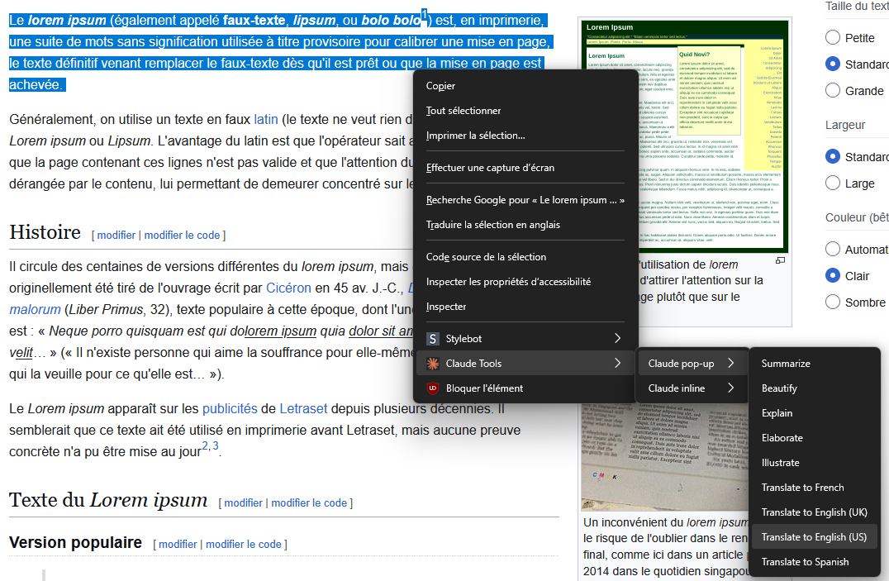
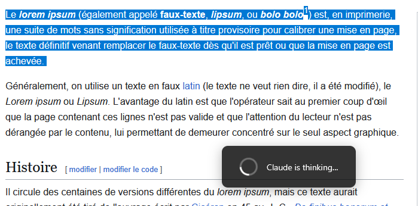
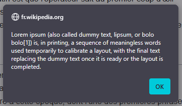
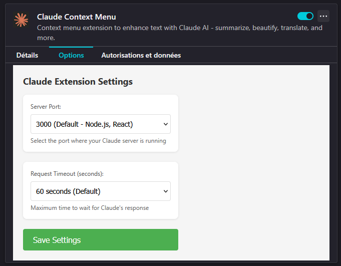

# Claude Extension for Firefox

Transform selected text with AI-powered tools directly from Firefox context menu.


## Features

- 🔄 **Summarize** - Get concise summaries of selected text
- ✨ **Beautify** - Fix grammar and improve writing  
- 📖 **Explain** - Get clear explanations of complex text
- 📝 **Elaborate** - Expand ideas with more detail
- 🎨 **Illustrate** - Generate SVG diagrams from text
- 🌍 **Translate** - Quick translation to French, Spanish, English (UK/US)
- 🔀 **Reformulate** - Rewrite text with professional vocabulary

## Screenshots

### Text Translation in Action

<table>
  <tr>
    <td align="center">
      
      <br><em>1. Right-click menu</em>
    </td>
    <td align="center">
      
      <br><em>2. Processing text</em>
    </td>
    <td align="center">
      
      <br><em>3. Translation result</em>
    </td>
  </tr>
</table>

## Installation

### From Firefox Add-ons
[](https://addons.mozilla.org/firefox/addon/claude-context-menu/)

Install the extension directly from the official Firefox Add-ons store.

## Requirements

⚠️ **Important**: This extension requires a local Claude server to function.

### Quick Start

1. **Install and start the Claude server as explained in [docs/INSTALL.md](docs/INSTALL.md)**:
   ```bash
   cd server
   npm install
   node server.js
   ```

2. **Configure the extension** (click extension icon → Settings)

## Usage

### Basic Usage
1. Select any text on a webpage
2. Right-click to open context menu
3. Navigate to "Claude Tools"
4. Choose between:
   - **Claude pop-up**: Results shown in an alert dialog
   - **Claude inline**: Text replaced directly in place

### Available Actions
- **Summarize**: Reduces text length by ~40% while keeping key information
- **Beautify**: Corrects grammar, spelling, and improves phrasing
- **Explain**: Provides definitions or explanations
- **Elaborate**: Expands text with more detail and formality
- **Illustrate**: Creates SVG diagrams based on content type
- **Translate**: Maintains tone while translating to target language
- **Reformulate**: Rewrites text with professional vocabulary and improved clarity

## Configuration

Click the extension icon → Open Settings to configure:

- **Server Port**: Select from 10 common ports (3000, 5000, 8080, etc.)
- **Request Timeout**: Choose between 30 seconds to 5 minutes

<div align="center">
  
  <br><em>Extension settings panel</em>
</div>

Settings are saved automatically and persist across browser sessions.

## Privacy & Security

- All processing happens locally through your Claude CLI
- No data is sent to external servers
- No analytics or tracking
- Extension only activates on user action (right-click)

## Links

- 🏠 **Homepage**: https://github.com/smeet666/claude-extension
- 📦 **Firefox Add-ons**: https://addons.mozilla.org/firefox/addon/claude-context-menu/
- 🐛 **Issues**: https://github.com/smeet666/claude-extension/issues

## Contributing

Contributions are welcome! Please feel free to submit a Pull Request.

## License

This project is licensed under the MIT License - see the [LICENSE](LICENSE) file for details.

## Author

- GitHub: [Damien Bouissou @smeet666](https://github.com/smeet666)